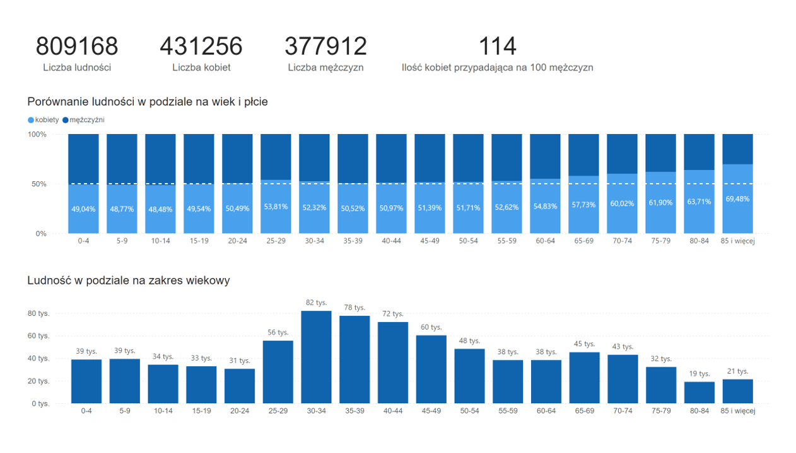

### Raport o stanie miasta Kraków 2024

Adres strony live : [jonatanglo.github.io](https://jonatanglo.github.io/portfolio/)

Najważniejsze dane:

1. liczba ludności: 809 168
2. Podział ludności na płcie: kobiety(431 256), mężczyźni(377 912)
3. Podzial ludności względem płci i wieku: ???
4. Średnia i mediana wieku (rok w którym się urodzili): ???
5. Ilość zawartych małżeństw 2024 roku: 4260
6. Gęstość zaludnienia (ludność na 1km^2): 2 475,7 (dodać porównianie do innych dużych polskich miast)
7. Powierzchnia Krakowa 327 km^2
8. 

Spis treści

1. Populacja
   - [Ludność w podziale na wiek i płeć](#ludnosc-w-podziale-na-wiek-i-plec)
3. Społeczność
4. Podział terytorialny
5. Finanse publiczne
6. Transport
7. Rynek pracy
8. Szkolnictwo

### Ludność w podziale na wiek i płeć {#ludnosc-w-podziale-na-wiek-i-plec}

